---
## Front matter
title: "Отчет по лабораторной работе №2"
subtitle: "Дисциплина: Архитектура компьютера"
author: "Жибицкая Евгения Дмитриевна"

## Generic otions
lang: ru-RU
toc-title: "Содержание"

## Bibliography
bibliography: bib/cite.bib
csl: pandoc/csl/gost-r-7-0-5-2008-numeric.csl

## Pdf output format
toc: true # Table of contents
toc-depth: 2
lof: true # List of figures
lot: true # List of tables
fontsize: 12pt
linestretch: 1.5
papersize: a4
documentclass: scrreprt
## I18n polyglossia
polyglossia-lang:
  name: russian
  options:
	- spelling=modern
	- babelshorthands=true
polyglossia-otherlangs:
  name: english
## I18n babel
babel-lang: russian
babel-otherlangs: english
## Fonts
mainfont: PT Serif
romanfont: PT Serif
sansfont: PT Sans
monofont: PT Mono
mainfontoptions: Ligatures=TeX
romanfontoptions: Ligatures=TeX
sansfontoptions: Ligatures=TeX,Scale=MatchLowercase
monofontoptions: Scale=MatchLowercase,Scale=0.9
## Biblatex
biblatex: true
biblio-style: "gost-numeric"
biblatexoptions:
  - parentracker=true
  - backend=biber
  - hyperref=auto
  - language=auto
  - autolang=other*
  - citestyle=gost-numeric
## Pandoc-crossref LaTeX customization
figureTitle: "Рис."
tableTitle: "Таблица"
listingTitle: "Листинг"
lofTitle: "Список иллюстраций"
lotTitle: "Список таблиц"
lolTitle: "Листинги"
## Misc options
indent: true
header-includes:
  - \usepackage{indentfirst}
  - \usepackage{float} # keep figures where there are in the text
  - \floatplacement{figure}{H} # keep figures where there are in the text
---

# Цель работы

Познакомиться с системой контроля версий git, изучить ее идеологию и применение,  приобрести практические навыки при работе с данной системой.

# Выполнение лабораторной работы

Для начала создадим учетную запись на сайте http://github.com/ (рис. 1).

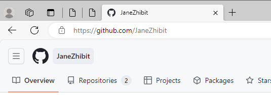{#fig:001 width=70%}

После сделаем предварительную конфигурацию git.  Для этого необходимо в терминале ввести команду git config --global и user.name/email (рис. 2).

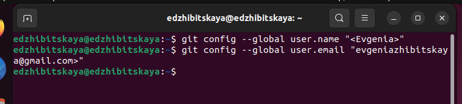{#fig:001 width=70%}

Также настроим utf-8 (core.quotepath false)(рис. 3)., назовем начальную ветку master, настроим параметры autocrlf  и safecrlf (рис. 4).

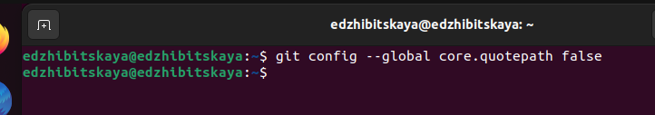{#fig:001 width=70%}

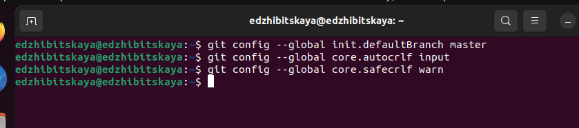{#fig:004 width=70%}

Затем необходимо создать SSH ключ(для индетификации пользователя на сервере)(рис. 5),(рис. 6),(рис 7).

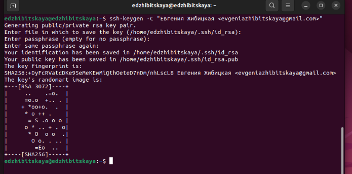{#fig:005 width=70%}

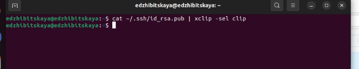{#fig:006 width=70%}

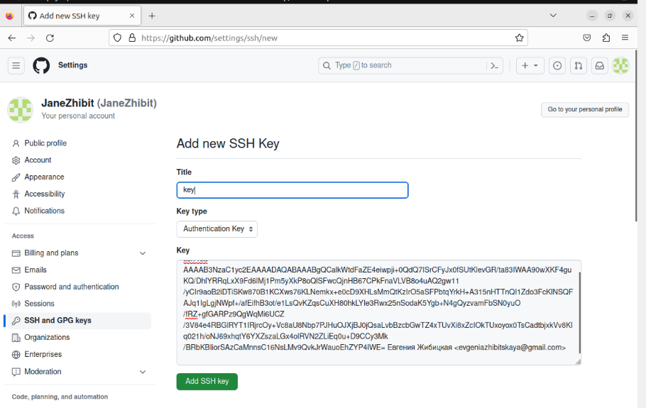{#fig:007 width=70%}

Создадим каталог для предмета  Архитектура компьютера, имеющий следуюущий путь: ~/work/study/2023-2024/»Архитектура компьютера», используем для этого команду mkdir и ключ p (рис. 8).

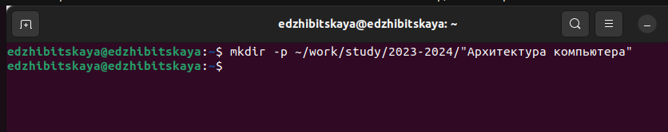{#fig:008 width=70%}

Также надо создать репозиторий на основе шаблона, это можно сделать через сайт. Переходим на страницу с шаблоном курса, используем шаблон, задаем имя  репозитория (рис. 9).

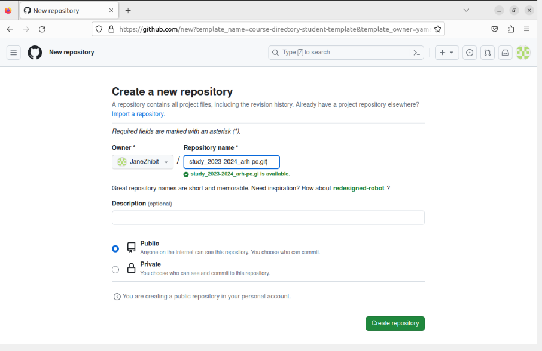{#fig:009 width=70%}

После открываем терминал, переходим в каталог курса (рис. 10)и клонируем созданный репозиторий (рис. 11).

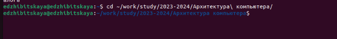{#fig:010 width=70%}

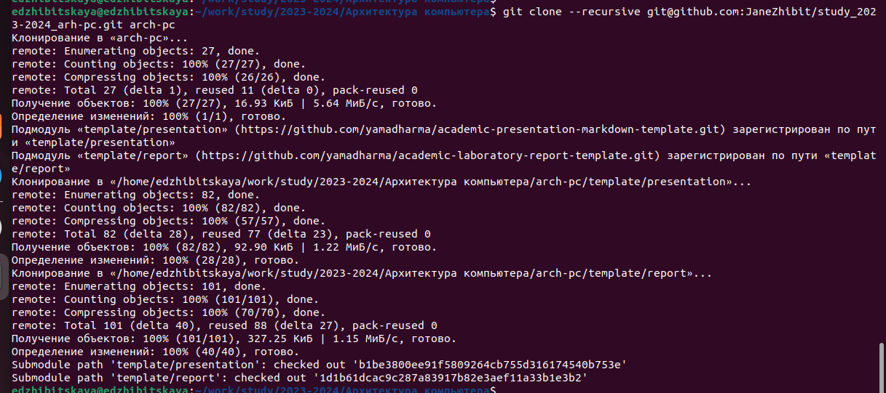{#fig:011 width=70%}

Последнее, что необходимо сделать, это настроить каталог.
Для начала перейдем в каталог(рис. 12) , удалим лишние файлы(рис. 13), потом создадим необходимые каталги(course)(рис. 14) и отправим файлы на сервер(рис. 15),(рис. 16),(рис. 17).

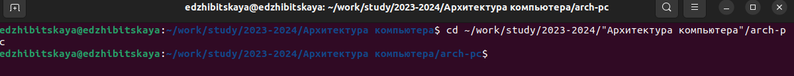{#fig:012 width=70%}

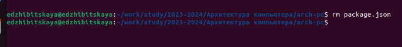{#fig:013 width=70%}

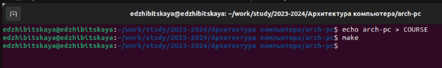{#fig:014 width=70%}

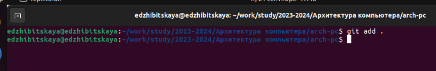{#fig:015 width=70%}

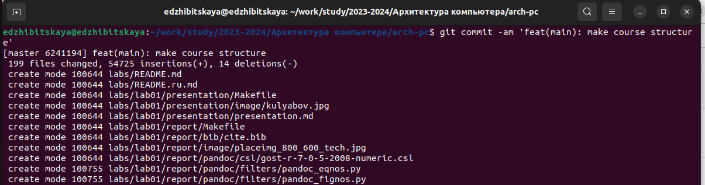{#fig:016 width=70%}

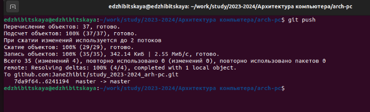{#fig:017 width=70%}

Убедимся, в правильности созданной иерархиии в локальном репозитории (рис. 18) и  на github (рис. 19).

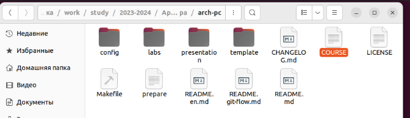{#fig:018 width=70%}

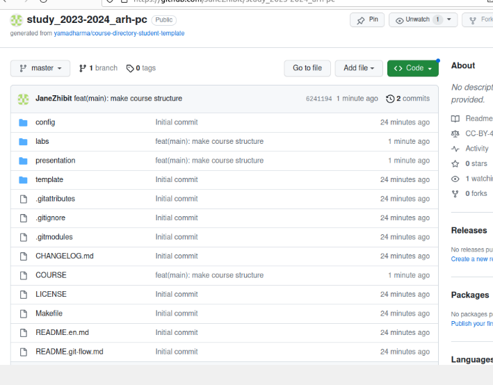{#fig:019 width=70%}

# Задание для самостоятельной работы

Задание 1. Создайте отчет по выполнению работы  в соответствующем каталоге рабочего пространства.

Для выполнения задания используем команду mv и переместим файл в нужные каталоги(подкатологи) (рис. 20).

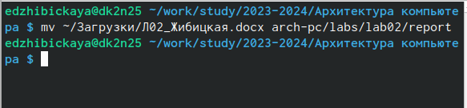{#fig:020 width=70%}

Задание 2.  Скопируйте отчеты по выполнению предыдущих работ в соответствующие каталоги рабочего пространства.

Используя команду копирования, скопируем 1й отчет в нужный каталог  и убедимся, что все правильно (рис. 21), (рис. 22).

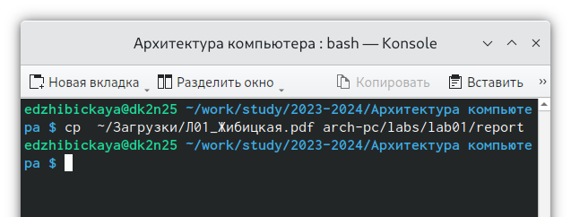{#fig:021 width=70%}

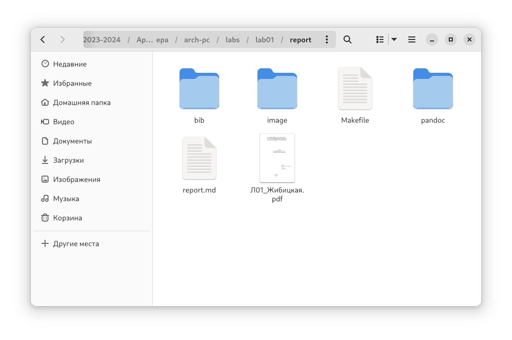{#fig:022 width=70%}

Задание 3.  Загрузка файлов на github.

Чтобы загрузить файлы на github, перейдем в нужные каталоги, затем используем команды git add(добавление всех файлов), git commit(сохрание файлов и комментарий), git push(отправка изменений в центральный репозиторий) (рис. 23), (рис. 24).

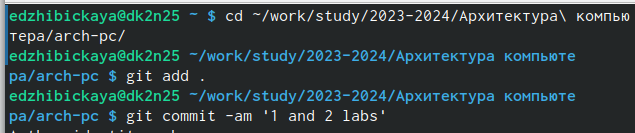{#fig:023 width=70%}

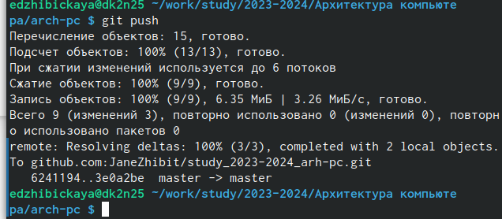{#fig:024 width=70%}

Проверим, что все загрузилось (рис. 25).

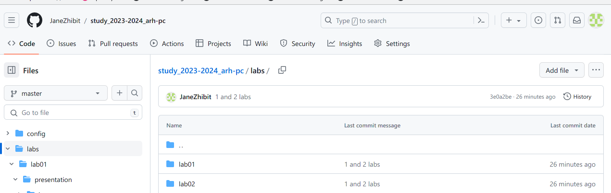{#fig:025 width=70%}

# Выводы

В ходе выполнения работы  мы ознакомились с системой  git, создали акккаунт на github, SSH ключ, приобрели различые навыки при работе с системой контроля версий.

:::
