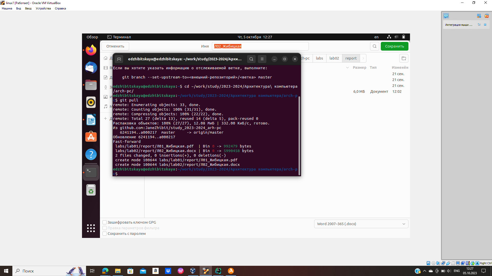
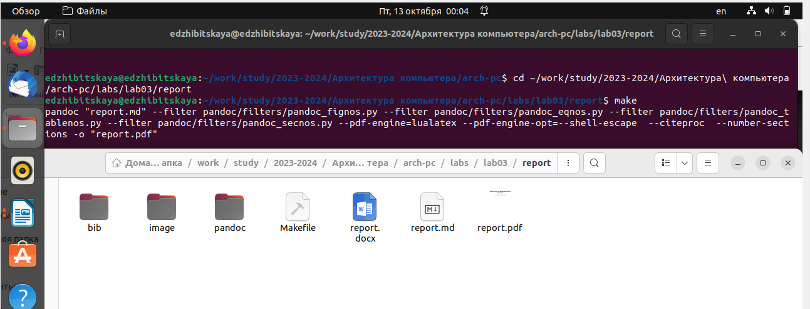
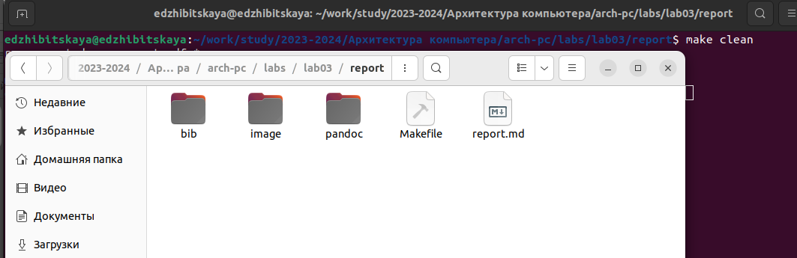
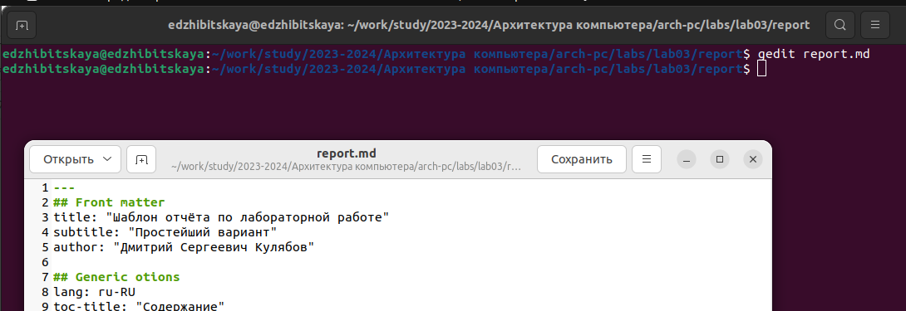
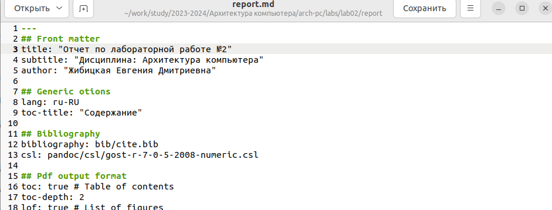
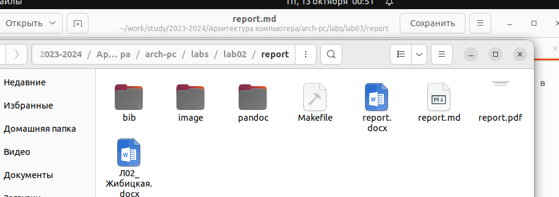
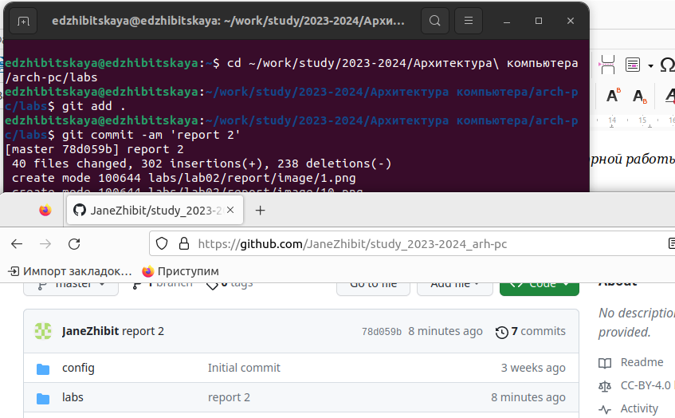

---
## Front matter
title: "Лабораторная работа №3"
subtitle: "Дисциплина: Архитектура компьютера"
author: "Жибицкая Евгения Дмитриевна"

## Generic otions
lang: ru-RU
toc-title: "Содержание"

## Bibliography
bibliography: bib/cite.bib
csl: pandoc/csl/gost-r-7-0-5-2008-numeric.csl

## Pdf output format
toc: true # Table of contents
toc-depth: 2
lof: true # List of figures
lot: true # List of tables
fontsize: 12pt
linestretch: 1.5
papersize: a4
documentclass: scrreprt
## I18n polyglossia
polyglossia-lang:
  name: russian
  options:
	- spelling=modern
	- babelshorthands=true
polyglossia-otherlangs:
  name: english
## I18n babel
babel-lang: russian
babel-otherlangs: english
## Fonts
mainfont: PT Serif
romanfont: PT Serif
sansfont: PT Sans
monofont: PT Mono
mainfontoptions: Ligatures=TeX
romanfontoptions: Ligatures=TeX
sansfontoptions: Ligatures=TeX,Scale=MatchLowercase
monofontoptions: Scale=MatchLowercase,Scale=0.9
## Biblatex
biblatex: true
biblio-style: "gost-numeric"
biblatexoptions:
  - parentracker=true
  - backend=biber
  - hyperref=auto
  - language=auto
  - autolang=other*
  - citestyle=gost-numeric
## Pandoc-crossref LaTeX customization
figureTitle: "Рис."
tableTitle: "Таблица"
listingTitle: "Листинг"
lofTitle: "Список иллюстраций"
lotTitle: "Список таблиц"
lolTitle: "Листинги"
## Misc options
indent: true
header-includes:
  - \usepackage{indentfirst}
  - \usepackage{float} # keep figures where there are in the text
  - \floatplacement{figure}{H} # keep figures where there are in the text
---

# Цель работы

Знакомство с языком разметки Markdown, изучение работы с ним и его шаблонами, создание отчетов с его помощью.

# Выполнение лабораторной работы

Для начала откроем терминал, перейдем в каталог курса и обновим локальный репозиторий, скачав изменения с github (рис.1).

{#fig:001 width=80%}

Затем  проведем компиляцию шаблона, перейдя в нужный каталог и используя команду make. Убедимся в успешности компиляции (рис.2).

{#fig:002 width=80%}

Удалим созданные файлы и убедимся в корректности выполнения (рис.3).

{#fig:003 width=80%}

После, откроем файл report.md с помощью функции gedit report.md и заполним отчет (рис.4). Создадим этот же отчет еще в форматах docx и pdf. 

{#fig:004 width=80%}

# Выполнение задания для самостоятельной работы

В каталоге для лабораторной работы №2 создаем отчет в формате Markdown (рис.5). 

{#fig:005 width=80%}

Также переформатируем его в форматы docx и pdf (рис.6).

{#fig:006 width=80%}

По завершении работы загрузим все изменения на github. Для этого используем команды git add, git commit, git push. Также убедимся в коректности выполнения работы (рис.7). 

{#fig:007 width=80%}

# Выводы

В ходе работа было произведено знакомство с Markdown, были изучены его шаблоны, особенности использования. Также были созданы отчеты к лабораторным работам №2 и №3с помощью данного языка разметки.

