---
## Front matter
title: "Лабораторная работа №4"
subtitle: "Дисциплина: Архитектура компьютера"
author: "Жибицкая Евгения Дмитриевна"

## Generic otions
lang: ru-RU
toc-title: "Содержание"

## Bibliography
bibliography: bib/cite.bib
csl: pandoc/csl/gost-r-7-0-5-2008-numeric.csl

## Pdf output format
toc: true # Table of contents
toc-depth: 2
lof: true # List of figures
lot: true # List of tables
fontsize: 12pt
linestretch: 1.5
papersize: a4
documentclass: scrreprt
## I18n polyglossia
polyglossia-lang:
  name: russian
  options:
	- spelling=modern
	- babelshorthands=true
polyglossia-otherlangs:
  name: english
## I18n babel
babel-lang: russian
babel-otherlangs: english
## Fonts
mainfont: PT Serif
romanfont: PT Serif
sansfont: PT Sans
monofont: PT Mono
mainfontoptions: Ligatures=TeX
romanfontoptions: Ligatures=TeX
sansfontoptions: Ligatures=TeX,Scale=MatchLowercase
monofontoptions: Scale=MatchLowercase,Scale=0.9
## Biblatex
biblatex: true
biblio-style: "gost-numeric"
biblatexoptions:
  - parentracker=true
  - backend=biber
  - hyperref=auto
  - language=auto
  - autolang=other*
  - citestyle=gost-numeric
## Pandoc-crossref LaTeX customization
figureTitle: "Рис."
tableTitle: "Таблица"
listingTitle: "Листинг"
lofTitle: "Список иллюстраций"
lotTitle: "Список таблиц"
lolTitle: "Листинги"
## Misc options
indent: true
header-includes:
  - \usepackage{indentfirst}
  - \usepackage{float} # keep figures where there are in the text
  - \floatplacement{figure}{H} # keep figures where there are in the text
---

# Цель работы

Знакомство с языком ассемблера NASM, освоение процедуры компиляции и сборки программ.

# Выполнение лабораторной работы

Для начала создадим каталог для работы с программами на языке ассемблера, а также перейдем в этот каталог(рис. @fig:001).

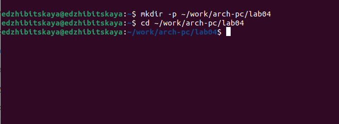{#fig:001 width=70%}

Затем создадим текстовый файл(touch),откроем его(gedit)(рис. @fig:002), введем необходимый текст(рис. @fig:003).

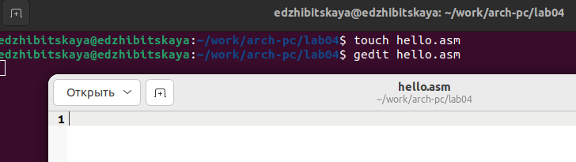{#fig:002 width=70%}

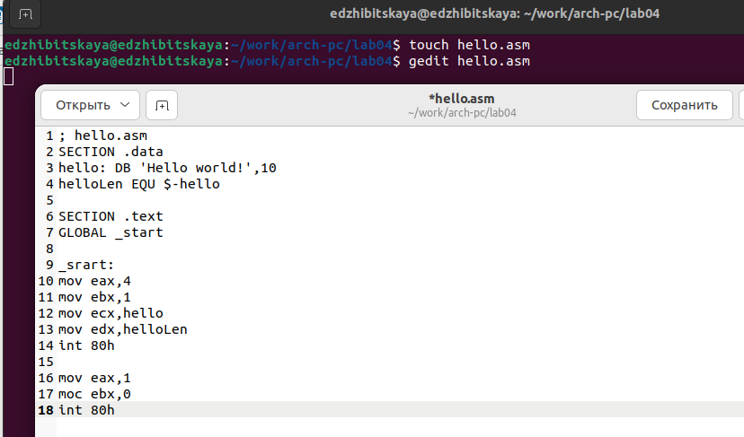{#fig:003 width=70%}

После введем  код: nasm -f elf hello.asm, он преобразует текст программы из файла в объектный код(рис. @fig:005).

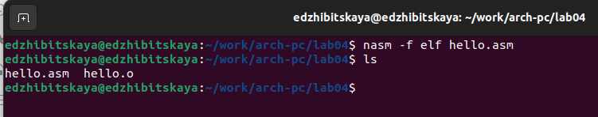{#fig:004 width=70%}

 С помощью команды nasm -o obj.o -f elf -g -l list.lst hello.asm скломпилируем файлы obj.o и list.lst, проверим, что они создались(рис. @fig:006).
 
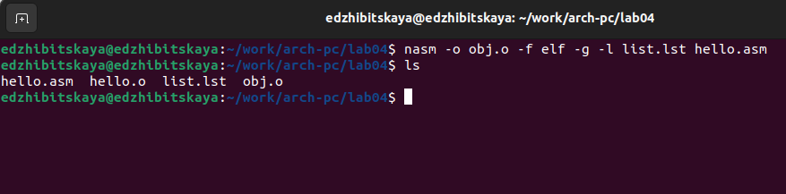{#fig:005 width=70%}

Затем надо передать файлы hello и main на компоновку, введем код ld -m elf_385 hello.o -o hello(рис. @fig:007) -o main(рис. @fig:008). Командой ls проверим, что они создались.

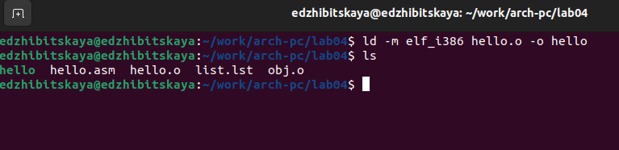{#fig:006 width=70%}

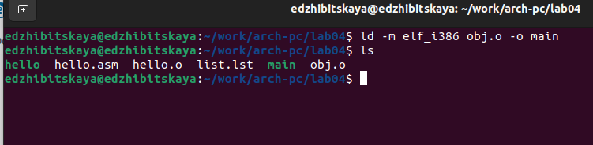{#fig:007 width=70%}

В конце запустим на выполнение файл, набрав ./hello(рис. @fig:009).

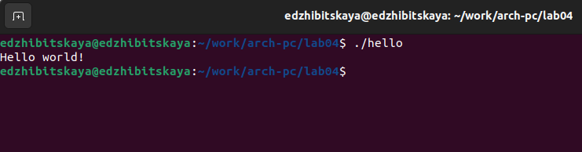{#fig:009 width=70%}

# Самостоятельная работа

Создадим копию файла..., назовем ее ..., использовав команду ....Проверим, что все получилось правильно(рис. @fig:010).

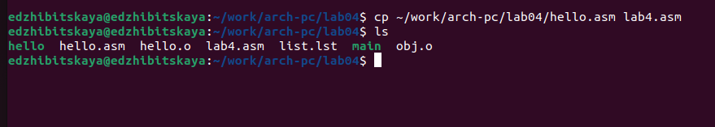{#fig:010 width=70%}

Изменим уже имеющийся код так, чтобы теперь выводились имя и фамилия(рис. @fig:011).

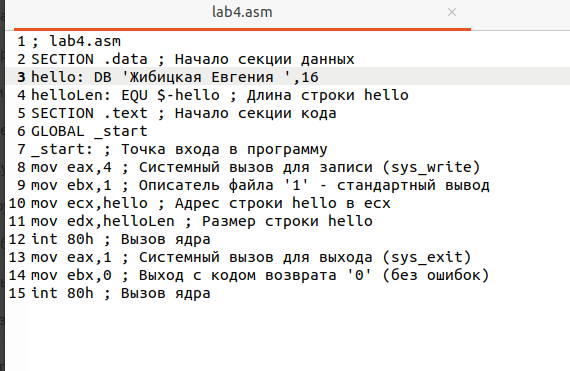{#fig:011 width=70%}

Затем преобразим его в объектный код,использовав nasm -f elf, он запишется в файл lab4.o, проверим с помощью  ls(рис. @fig:012),(рис. @fig:013).

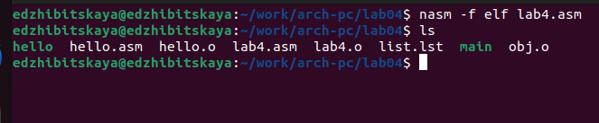{#fig:012 width=70%}

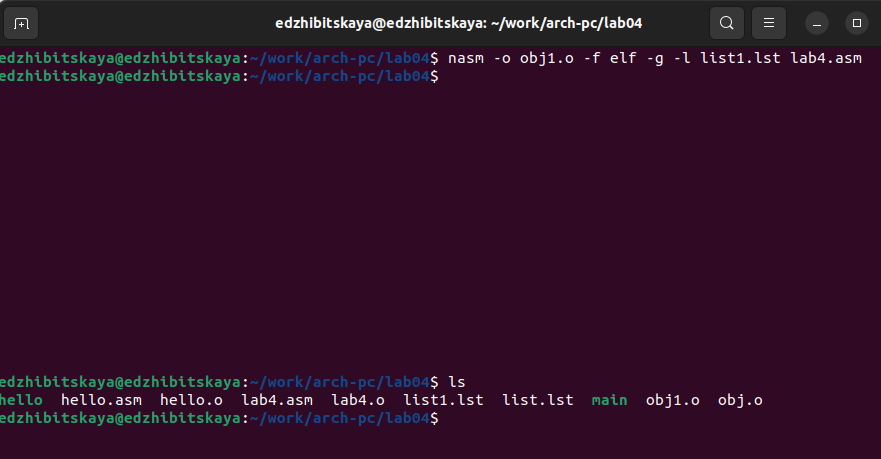{#fig:013 width=70%}

Скомпонуем файл командой ld, запустим программу, написав ./lab4(рис. @fig:014).

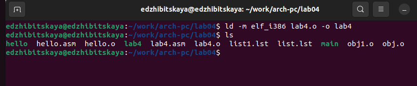{#fig:014 width=70%}

В конце  скопируем файлы hello.asm и lab4.asm в локальный репозиторий в ката-
лог ~/work/study/2023-2024/"Архитектура компьютера"/arch-pc/labs/lab04(рис. @fig:015).

Командой make создадим отчет в форматах pdf и docx, сохраним изменения на github.

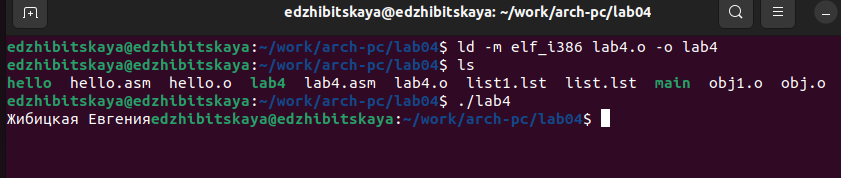{#fig:015 width=70%}

# Выводы

В ходе работы было произведено знакомство с языком NASM и принципами его работы, также была написана небольшая программа, выводящая инициалы.

