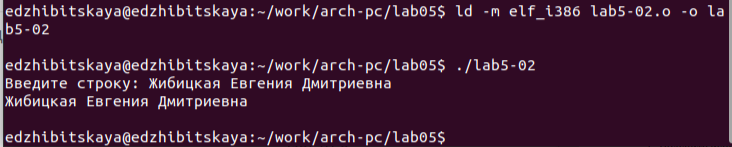

---
## Front matter
title: "Лабораторная работа №5"
subtitle: "Дисциплина: Архитектура компьютера"
author: "Жибицкая Евгения Дмитриевна"

## Generic otions
lang: ru-RU
toc-title: "Содержание"

## Bibliography
bibliography: bib/cite.bib
csl: pandoc/csl/gost-r-7-0-5-2008-numeric.csl

## Pdf output format
toc: true # Table of contents
toc-depth: 2
lof: true # List of figures
lot: true # List of tables
fontsize: 12pt
linestretch: 1.5
papersize: a4
documentclass: scrreprt

## I18n polyglossia
polyglossia-lang:
  name: russian
  options:
	- spelling=modern
	- babelshorthands=true
polyglossia-otherlangs:
  name: english
  
## I18n babel
babel-lang: russian
babel-otherlangs: english

## Fonts
mainfont: PT Serif
romanfont: PT Serif
sansfont: PT Sans
monofont: PT Mono
mainfontoptions: Ligatures=TeX
romanfontoptions: Ligatures=TeX
sansfontoptions: Ligatures=TeX,Scale=MatchLowercase
monofontoptions: Scale=MatchLowercase,Scale=0.9

## Biblatex
biblatex: true
biblio-style: "gost-numeric"
biblatexoptions:
  - parentracker=true
  - backend=biber
  - hyperref=auto
  - language=auto
  - autolang=other*
  - citestyle=gost-numeric
  
## Pandoc-crossref LaTeX customization
figureTitle: "Рис."
tableTitle: "Таблица"
listingTitle: "Листинг"
lofTitle: "Список иллюстраций"
lotTitle: "Список таблиц"
lolTitle: "Листинги"

## Misc options
indent: true
header-includes:
  - \usepackage{indentfirst}
  - \usepackage{float} # keep figures where there are in the text
  - \floatplacement{figure}{H} # keep figures where there are in the text
  
## pandoc-tablenos

pandoc-tablenos:
- \usepackage{caption}

pandoc-tablenos:
- \makeatletter
- \newcounter{tableno}
- \newenvironment{tablenos:no-prefix-table-caption}{
	- \caption@ifcompatibility{}{
		- \let\oldthetable\thetable
		- \let\oldtheHtable\theHtable
		- \renewcommand{\thetable}{tableno:\thetableno}
		- \renewcommand{\theHtable}{tableno:\thetableno}
		- \stepcounter{tableno}
		- \captionsetup{labelformat=empty}
	}
	}{
- \caption@ifcompatibility{}{
		- \captionsetup{labelformat=default}
		- \let\thetable\oldthetable
		- \let\theHtable\oldtheHtable		
		- \addtocounter{table}{-1}
	}
	}
- \makeatother

  
---

# Цель работы

Изучение Midnight Commander, приобретение навыков по работе с ним, а также освоение инструкций языка ассемблера.

# Выполнение лабораторной работы

Для начала  откроем Midnight Commander и создадим нужный каталог (рис. @fig:001).

{#fig:001 width=70%}

Затем создадим командой touch файл lab5-1.asm(рис. @fig:002),(рис. @fig:003).

{#fig:002 width=70%}

{#fig:003 width=70%}

Откроем этот файл, введем текст программы и убедимся, что все сохранилось(рис. @fig:004),(рис. @fig:005).

{#fig:004 width=70%}

{#fig:005 width=70%}

Оттранслируеем текст в объектный файл, скомпонуем его и запустим(рис. @fig:006). 

{#fig:006 width=70%}

Затем скачаем файл из ТУИС,с помощью клавиши f5 скопируем его в нужный каталог (рис. @fig:007), клавишей f6 создадим файл lab5-2.asm (рис. @fig:008).

{#fig:007 width=70%}

{#fig:008 width=70%} 

Также введем текст программы, создадим исполняемый файл и запустим его. Кроме того запустим также замененный sprintLF на sprint(отличается переносом строки)(рис. @fig:009),(рис. @fig:010),(рис. @fig:011),(рис. @fig:012). 

{#fig:009 width=70%}

{#fig:010 width=70%}

{#fig:011 width=70%}

{#fig:012 width=70%}

# Задание для самостоятельной работы

Сначала скопируем файл с кодом, назовем его ..., затем изменим его(рис. @fig:013), создадим исполняемый файл и убедимся, что введеная строка печатается(рис. @fig:014).

{#fig:013 width=70%}

{#fig:014 width=70%}
 
 
 
Также проделаем те же действия, но для программы с использованием in_out.asm(рис. @fig:015),(рис. @fig:016).

{#fig:015 width=70%}

{#fig:016 width=70%}

# Выводы

В ходе работы были приобретены навыки по работе с Midnight Commander, изучены инструкции mov и int.

# Список литературы{.unnumbered}

::: {#refs}
:::
