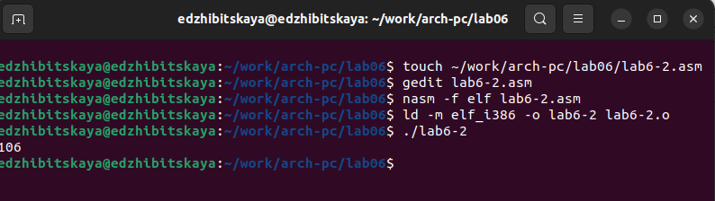

---
## Front matter
title: "Лабораторная работа № 6"
subtitle: "Дисциплина: Архитектура компьютера"
author: "Жибицкая Евгения Дмитриевна"

## Generic otions
lang: ru-RU
toc-title: "Содержание"

## Bibliography
bibliography: bib/cite.bib
csl: pandoc/csl/gost-r-7-0-5-2008-numeric.csl

## Pdf output format
toc: true # Table of contents
toc-depth: 2
lof: true # List of figures
lot: true # List of tables
fontsize: 12pt
linestretch: 1.5
papersize: a4
documentclass: scrreprt
## I18n polyglossia
polyglossia-lang:
  name: russian
  options:
	- spelling=modern
	- babelshorthands=true
polyglossia-otherlangs:
  name: english
## I18n babel
babel-lang: russian
babel-otherlangs: english
## Fonts
mainfont: PT Serif
romanfont: PT Serif
sansfont: PT Sans
monofont: PT Mono
mainfontoptions: Ligatures=TeX
romanfontoptions: Ligatures=TeX
sansfontoptions: Ligatures=TeX,Scale=MatchLowercase
monofontoptions: Scale=MatchLowercase,Scale=0.9
## Biblatex
biblatex: true
biblio-style: "gost-numeric"
biblatexoptions:
  - parentracker=true
  - backend=biber
  - hyperref=auto
  - language=auto
  - autolang=other*
  - citestyle=gost-numeric
## Pandoc-crossref LaTeX customization
figureTitle: "Рис."
tableTitle: "Таблица"
listingTitle: "Листинг"
lofTitle: "Список иллюстраций"
lotTitle: "Список таблиц"
lolTitle: "Листинги"
## Misc options
indent: true
header-includes:
  - \usepackage{indentfirst}
  - \usepackage{float} # keep figures where there are in the text
  - \floatplacement{figure}{H} # keep figures where there are in the text
---

# Цель работы

Продолжение знакомства с языком ассемблера, освоение арифметических операций NASM.

# Выполнение лабораторной работы

 Начнем работу с того, что cоздадим каталог lab06 и файл lab6-1.asm(mkdir ~/work/arch-pc/lab06; cd ~/work/arch-pc/lab06; touch lab6-1.asm)
 Скопируем файл in_out.asm в lab06  и вставим код из Листинг 6.1 в lab6-1.asm(рис. @fig:001).

{#fig:001 width=70%}

 Создадим исполняемый файл и запустим его(рис. @fig:002).

{#fig:002 width=70%}

 Затем  изменим текст программы и вместо символов, запишем в регистры числа, так как в предыдущий раз программа не вывела ожидаемый результат, также создадим исполняемый файл и запустим программу (рис. @fig:003).

{#fig:003 width=70%}

 Далее создадим файл lab6-2.asm, введем в него текст из Листинг 6.2, создадим исполняемый файл и запустим(рис. @fig:004).

{#fig:004 width=70%}

 Опять заменим символы на числа и запустим программу.(рис. @fig:005).

{#fig:005 width=70%}

 В конце запустим программу еще раз, заменив iprintLF на iprint(отличаются наличием/отсутсвием переноса строки)(рис. @fig:006).

{#fig:006 width=70%}

Еще создадим файл lab6-3.asm и заполним его текстом из Листинг 6.3(рис. @fig:007).

{#fig:007 width=70%}

 Создадим исполняемый файл и запустим его.(рис. @fig:008).

{#fig:008 width=70%}

 Изменим имеющуюся программу, для вычисления f(x) = (4 * 6 + 2)/5 (рис. @fig:009].

{#fig:009 width=70%}

 Затем запустим и проверим корректность работы (рис. @fig:010).

{#fig:010 width=70%}

 В конце создадим файл variant.asm, заполним его текстом из Листинг 6.4, создадим исполняемый файл и запустим(рис. @fig:011).

{#fig:011 width=70%}

 Далее ответим на следующие вопросы:
 
1. Какие строки листинга 6.4 отвечают за вывод на экран сообщения ‘Ваш вариант:’?

mov eax,rem
call sprint

2. Для чего используется следующие инструкции?
mov ecx, x
mov edx, 80
call sread

Для считывания переменной  x.

3. Для чего используется инструкция “call atoi”?

Для преобразования ascii-код символа в целое число.

4. Какие строки листинга 6.4 отвечают за вычисления варианта?

xor edx,edx
mov ebx,20
div ebx
inc edx

5. В какой регистр записывается остаток от деления при выполнении инструкции “div
ebx”?

AH

6. Для чего используется инструкция “inc edx”?

Для прибавления единицы к значению регистра ebx.

7. Какие строки листинга 6.4 отвечают за вывод на экран результата вычислений?

mov eax,edx
call iprintLF

# Задание для самостоятельной работы
 
 Создадим файл task.asm для выполнения задания, напишем туда программу для вычисления выражения(10(x + 1) − 10), x = 1, x = 7(рис. @fig:012).

{#fig:012 width=70%}

Запустим файл и убедимся в корректности работы(рис. @fig:013).

{#fig:013 width=70%}

 
# Выводы

 В ходе работы было произведено знакомство с арифметическими инструкциями языка ассемблера NASM, изучены некоторые его особенности, а также написана небольщая программа вычисления выражения.

