---
## Front matter
title: "Лабораторная работа №7"
subtitle: "Дисциплина: Архитектура компьютера"
author: "Жибицкая Евгения Дмитриевна"

## Generic otions
lang: ru-RU
toc-title: "Содержание"

## Bibliography
bibliography: bib/cite.bib
csl: pandoc/csl/gost-r-7-0-5-2008-numeric.csl

## Pdf output format
toc: true # Table of contents
toc-depth: 2
lof: true # List of figures
lot: true # List of tables
fontsize: 12pt
linestretch: 1.5
papersize: a4
documentclass: scrreprt
## I18n polyglossia
polyglossia-lang:
  name: russian
  options:
	- spelling=modern
	- babelshorthands=true
polyglossia-otherlangs:
  name: english
## I18n babel
babel-lang: russian
babel-otherlangs: english
## Fonts
mainfont: PT Serif
romanfont: PT Serif
sansfont: PT Sans
monofont: PT Mono
mainfontoptions: Ligatures=TeX
romanfontoptions: Ligatures=TeX
sansfontoptions: Ligatures=TeX,Scale=MatchLowercase
monofontoptions: Scale=MatchLowercase,Scale=0.9
## Biblatex
biblatex: true
biblio-style: "gost-numeric"
biblatexoptions:
  - parentracker=true
  - backend=biber
  - hyperref=auto
  - language=auto
  - autolang=other*
  - citestyle=gost-numeric
## Pandoc-crossref LaTeX customization
figureTitle: "Рис."
tableTitle: "Таблица"
listingTitle: "Листинг"
lofTitle: "Список иллюстраций"
lotTitle: "Список таблиц"
lolTitle: "Листинги"
## Misc options
indent: true
header-includes:
  - \usepackage{indentfirst}
  - \usepackage{float} # keep figures where there are in the text
  - \floatplacement{figure}{H} # keep figures where there are in the text
---

# Цель работы

Продолжение изучения языка ассемблера, знакомство с командами условного и безусловного переходов и с назначением и структурой файла листинга.

# Выполнение лабораторной работы

Для начала создадим каталог для 7 лабораторной работы, перейдем туда и создадим файл lab7-1.asm (рис. @fig:001).
Также не забудем скопировать файл in_out.asm .

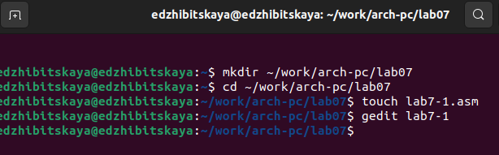{#fig:001 width=70%}

Заполним файл текстом Листинга 7.1, создадим объектный файл и запустим его(рис. @fig:002).

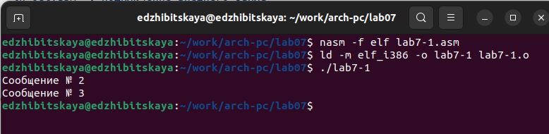{#fig:002 width=70%}

Заменим содержимое файла на текст из Листинга 7-2, создадим объектный файл и запустим программу (рис. @fig:003).

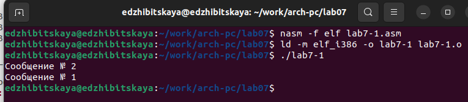{#fig:003 width=70%}

Изменим код так, чтобы выводилось 3-2-1 сообщения, запустим и проверим(рис. @fig:004),(рис. @fig:005).

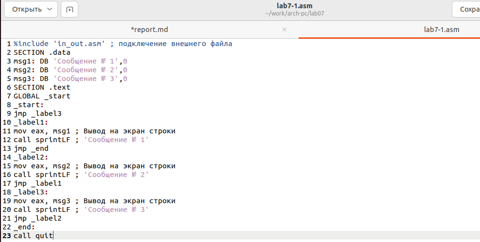{#fig:004 width=70%}

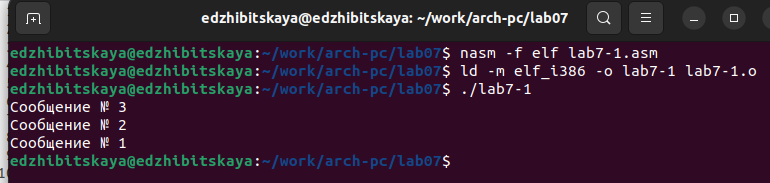{#fig:005 width=70%}

Затем создадим файл lab7-2.asm, введем туда текст Листинга 7-3, создадим объектный файл и проверим корректность работы на нескольких числах(рис. @fig:006).

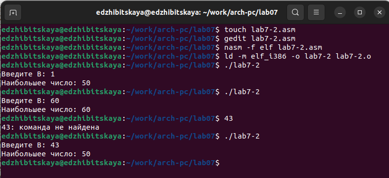{#fig:006 width=70%}

Командой nasm создадим объектный файл и, указав ключ -l и задав имя файла, файл листинга (рис. @fig:007).

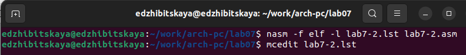{#fig:007 width=70%}

Командой mcedit откроем файл листинга, изучим его содержимое(рис. @fig:008).

Опишем из чего состоят 8-10 строки.
8 строка состоит только из номера строки и исходного текста программы. 9 и 10 строки содержат номер, затем адрес(8цифр), машинный код и исходный текст программы.

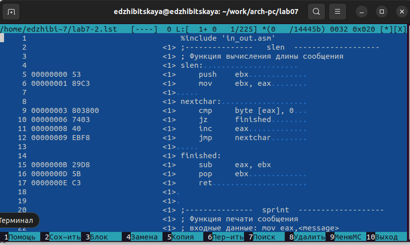{#fig:008 width=70%}

В конце в инструкции с двумя операндами удалим один операнд, оттранслируем его и получим листинг(рис. @fig:009),(рис. @fig:010).

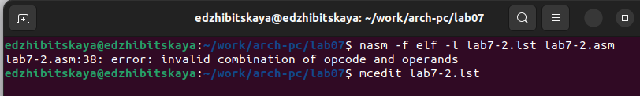{#fig:009 width=70%}

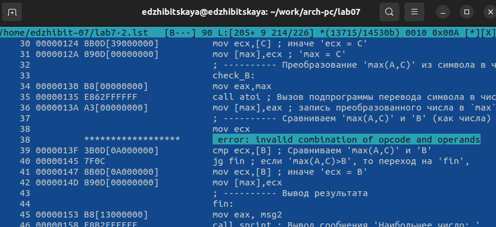{#fig:010 width=70%}

# Самостоятельная работа

Для выполнения первого задания создадим файл task7-1, напишем код для вычисления наименьшего значения(рис. @fig:011),(рис. @fig:012) и проверим его работу(рис. @fig:013).

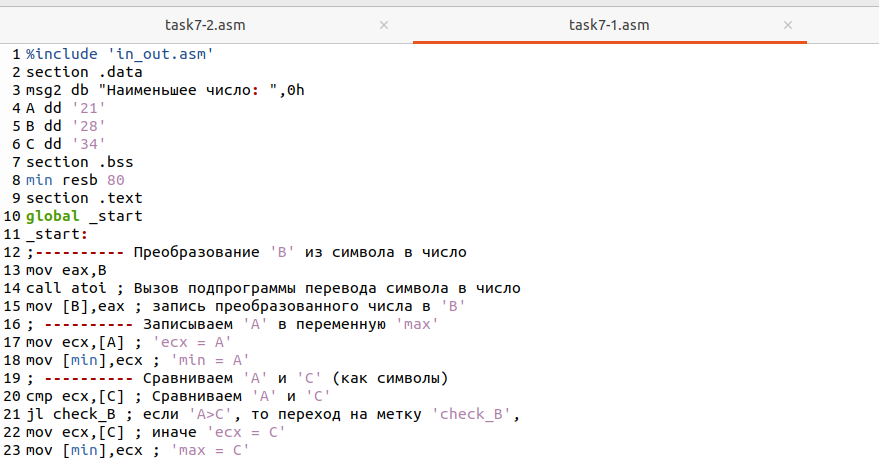{#fig:011 width=70%}

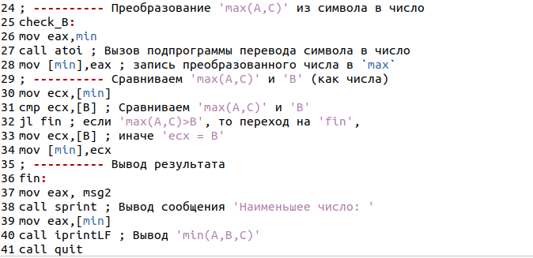{#fig:012 width=70%}

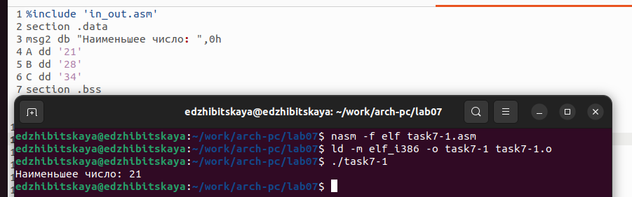{#fig:013 width=70%}

Проделаем аналогичные действия для задания 2(рис. @fig:014),(рис. @fig:015) (рис. @fig:016).

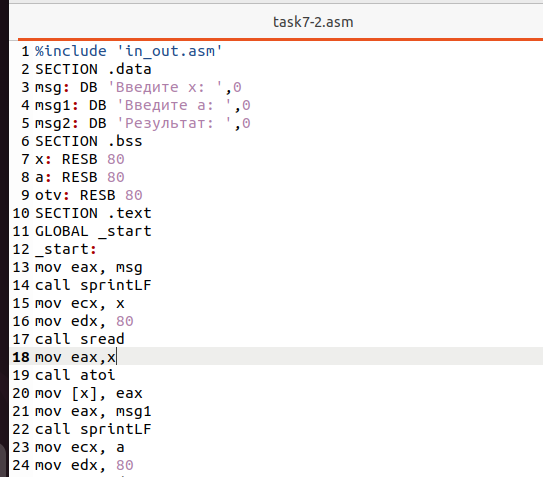{#fig:014 width=70%}

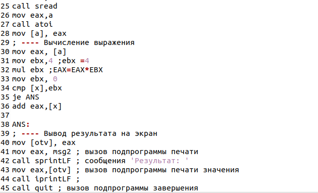{#fig:015 width=70%}

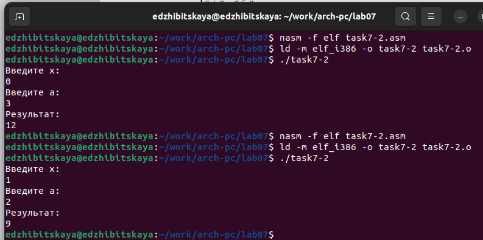{#fig:016 width=70%}

# Выводы

В ходе работы было произведено знакомство с командами переходов, со структурой файла листинга. Также были написаны команды с использованием переходов.

