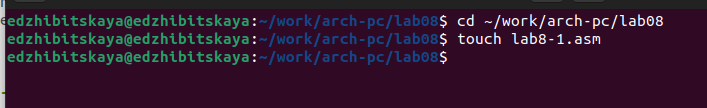
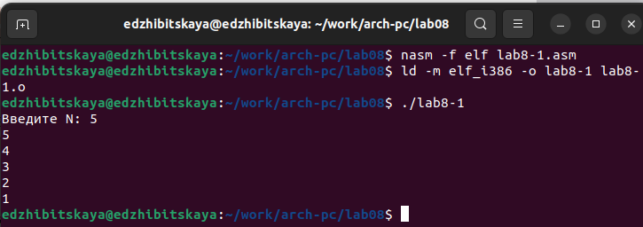
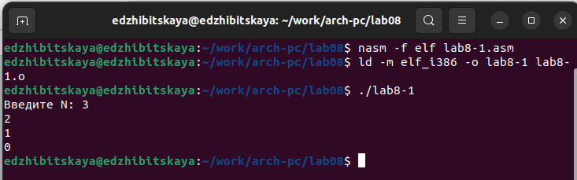
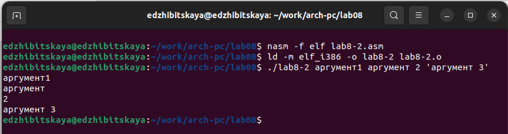
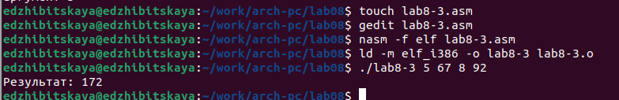
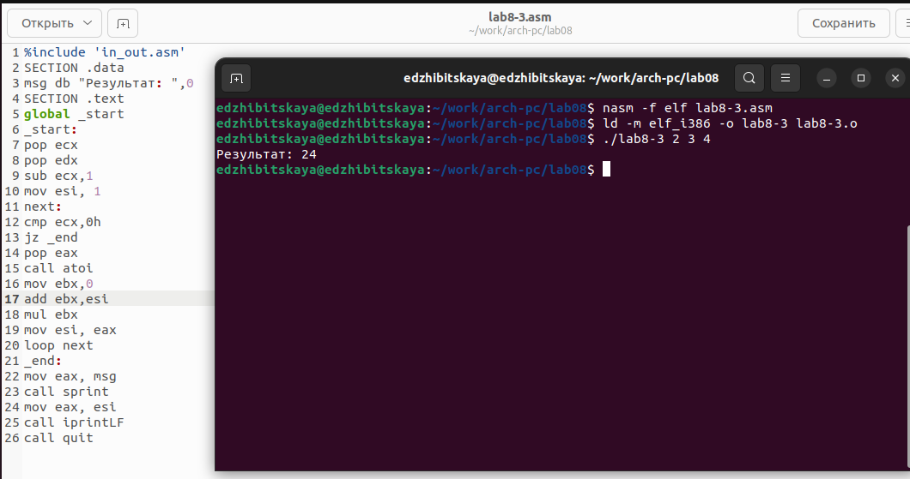
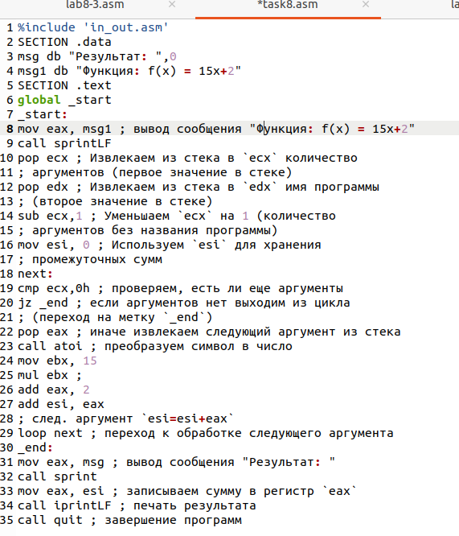
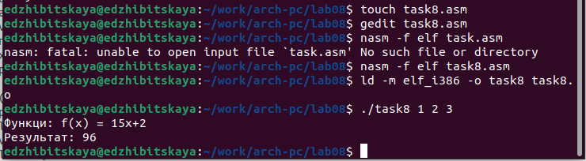

---
## Front matter
title: "Лабораторная работа №8"
subtitle: "Дисциплина: Архитектура компьютера"
author: "Жибицкая Евгения Дмитриевна"

## Generic otions
lang: ru-RU
toc-title: "Содержание"

## Bibliography
bibliography: bib/cite.bib
csl: pandoc/csl/gost-r-7-0-5-2008-numeric.csl

## Pdf output format
toc: true # Table of contents
toc-depth: 2
lof: true # List of figures
lot: true # List of tables
fontsize: 12pt
linestretch: 1.5
papersize: a4
documentclass: scrreprt
## I18n polyglossia
polyglossia-lang:
  name: russian
  options:
	- spelling=modern
	- babelshorthands=true
polyglossia-otherlangs:
  name: english
## I18n babel
babel-lang: russian
babel-otherlangs: english
## Fonts
mainfont: PT Serif
romanfont: PT Serif
sansfont: PT Sans
monofont: PT Mono
mainfontoptions: Ligatures=TeX
romanfontoptions: Ligatures=TeX
sansfontoptions: Ligatures=TeX,Scale=MatchLowercase
monofontoptions: Scale=MatchLowercase,Scale=0.9
## Biblatex
biblatex: true
biblio-style: "gost-numeric"
biblatexoptions:
  - parentracker=true
  - backend=biber
  - hyperref=auto
  - language=auto
  - autolang=other*
  - citestyle=gost-numeric
## Pandoc-crossref LaTeX customization
figureTitle: "Рис."
tableTitle: "Таблица"
listingTitle: "Листинг"
lofTitle: "Список иллюстраций"
lotTitle: "Список таблиц"
lolTitle: "Листинги"
## Misc options
indent: true
header-includes:
  - \usepackage{indentfirst}
  - \usepackage{float} # keep figures where there are in the text
  - \floatplacement{figure}{H} # keep figures where there are in the text
---

# Цель работы

Продолжение освоения языка ассемблера. Изучение написания программ с использованием циклов и обработкой
аргументов командной строки.

# Выполнение лабораторной работы

Для начала создадим все необходимые файлы и каталоги, также не забудем скопировать файл in_out.asm(рис. @fig:001).

{#fig:001 width=70%}

Затем создадим файл lab8-1.asm, заполним его текстом из Лиситнга 8.1, создадим исполняемый файл и запустим(рис. @fig:002).

{#fig:002 width=70%}

Немного изменим содержимое кода и еще раз запустим(при этом запуске программа выодит бесконечный набор чисел).

Еще раз изменим код, добавив команды push и pop (рис. @fig:004).

{#fig:004 width=70%}

Для изучения работы с аргументами создадим lab8-2.asm, введем текст Листинга 8.2, создадим исполняемый файл и запустим программу(рис. @fig:005).

{#fig:005 width=70%}

Наконец создадим файл lab8-3.asm, заполним его текстом Листинга 8.3, создадим исполняемый файл и запустим(рис. @fig:006). В конце изменим код так, чтобы вместо суммы програама считала произведение введеных значений(рис. @fig:007)

{#fig:006 width=70%}

{#fig:007 width=70%}

# Задание для самостоятельной работы

Напишем программу, которая находит сумму значений функции из 11 варианта(рис. @fig:008),(рис. @fig:009)

{#fig:008 width=70%}

{#fig:009 width=70%}

# Выводы

В ходе работы было произведено знакомство с принципами работы циклов и использовании аргументов, написана небольшая программа

:::
