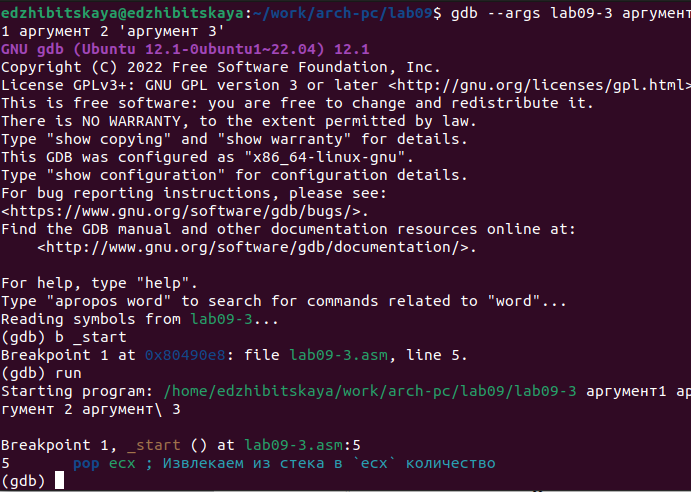
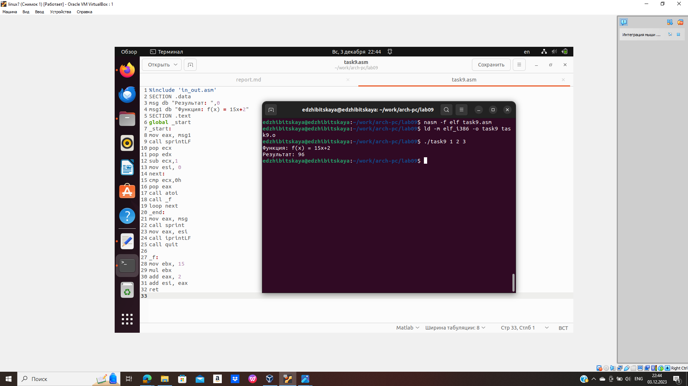

---
## Front matter
title: "Лабораторная работа №9"
subtitle: "Дисциплина: Архитектура компьютера"
author: "Жибицкая Евгения Дмитриевна"

## Generic otions
lang: ru-RU
toc-title: "Содержание"

## Bibliography
bibliography: bib/cite.bib
csl: pandoc/csl/gost-r-7-0-5-2008-numeric.csl

## Pdf output format
toc: true # Table of contents
toc-depth: 2
lof: true # List of figures
lot: true # List of tables
fontsize: 12pt
linestretch: 1.5
papersize: a4
documentclass: scrreprt
## I18n polyglossia
polyglossia-lang:
  name: russian
  options:
	- spelling=modern
	- babelshorthands=true
polyglossia-otherlangs:
  name: english
## I18n babel
babel-lang: russian
babel-otherlangs: english
## Fonts
mainfont: PT Serif
romanfont: PT Serif
sansfont: PT Sans
monofont: PT Mono
mainfontoptions: Ligatures=TeX
romanfontoptions: Ligatures=TeX
sansfontoptions: Ligatures=TeX,Scale=MatchLowercase
monofontoptions: Scale=MatchLowercase,Scale=0.9
## Biblatex
biblatex: true
biblio-style: "gost-numeric"
biblatexoptions:
  - parentracker=true
  - backend=biber
  - hyperref=auto
  - language=auto
  - autolang=other*
  - citestyle=gost-numeric
## Pandoc-crossref LaTeX customization
figureTitle: "Рис."
tableTitle: "Таблица"
listingTitle: "Листинг"
lofTitle: "Список иллюстраций"
lotTitle: "Список таблиц"
lolTitle: "Листинги"
## Misc options
indent: true
header-includes:
  - \usepackage{indentfirst}
  - \usepackage{float} # keep figures where there are in the text
  - \floatplacement{figure}{H} # keep figures where there are in the text
---

# Цель работы

Продолжение изучения языка ассемблера, использование подпрограмм и знакомство с  методами отладки при помощи GDB.

# Выполнение лабораторной работы

Для начала создадим каталог для 9 лабораторной работы, создадим файл и не забудем скопировать файл in_out.asm в этот же каталог(рис. @fig:001).

{#fig:001 width=70%}

Затем заполним файл текстом из Листинга 9.1, создадим исполняемый файл и запустим(рис. @fig:002).

{#fig:002 width=70%}

Потом изменим программу, добавив подпрограмму _subcalcul и также запустим ее(рис. @fig:003).

{#fig:003 width=70%}

Далее добавим файл lab09-2.asm с текстом программы из Листинга 9.2, создадим исполняемый файл с ключом -g для отладочной информации и загрузим его в отладчик(рис. @fig:004).

{#fig:004 width=70%}

Затем командой run запустим программу(рис. @fig:005), также добавим брейкпоинт и еще раз запустим ее(рис. @fig:006).

{#fig:005 width=70%}

{#fig:006 width=70%}

Посмотрим дисассимилированный код программы командой disassemble(рис. @fig:007), также переключимся на отображение с Intel’овским синтаксисом(рис. @fig:008).
Отличаются порядком операндов, записью числовых констант, наличием/отсутствием % перед именем регистра и тд.

{#fig:007 width=70%}

{#fig:008 width=70%}

Далее включим режим псевдографики и сразу посмотрим уже установленные ранее точки останова(рис. @fig:009)

{#fig:009 width=70%}

Установим еще один брейкпоинт и еще раз проверим информацию о всех точках останова(рис. @fig:010).

{#fig:010 width=70%}

Чтобы посмотреть содержимое регистров введем info registers(рис. @fig:011).

{#fig:011 width=70%}

Затем посмотрим значение переменной msg1 по имени и msg2 по адресу(рис. @fig:012).

{#fig:012 width=70%}

После инструкцией set изменим символы в переменных msg1 и msg2(рис. @fig:014)

{#fig:014 width=70%}

Наконец командой print посмотрим значения регистра(в 16ричном,2оичном и символьном форматах)(рис. @fig:015) и изменим значение регистра ebx(симол и число)(рис. @fig:016).

{#fig:015 width=70%}

{#fig:016 width=70%}

Следующим этапом скопируем файл из предыдущией работы и создадим исполняемый файл(рис. @fig:017).

{#fig:017 width=70%}

Загрузим эту программу в отладчик использовав ключ --args, установим точку останова и запустим ее(рис. @fig:018).

{#fig:018 width=70%}

В конце посмотрим, что число аргументов равно 5 - посмотрим остальные позиции стека по адресу(рис. @fig:019).

{#fig:019 width=70%}

# Задание для самостоятельной работы

1. Преобразуем программу из 8 лабораторной работы, реализовав вычисление функции как подпрограммы(рис. @fig:020).

{#fig:020 width=70%}

2. Определение и исправление ошибки из Лиситнга 9.3
C  помощью отладчика gdb, поочередно выполняя команды и следя за значениями регистров, видим, что ошибка возникает из-за неправильной записи резултата сложения в регистр ebx, а не eax, так как при последующем умножении, умножается именно регистр eax(рис. @fig:021).

{#fig:021 width=70%}

Исправим код программы и запустим ее(рис. @fig:022).

{#fig:022 width=70%}

# Выводы

В ходе работы было произведено знакомство с методами и возможностями отладки программ, применены подпрограммы.

