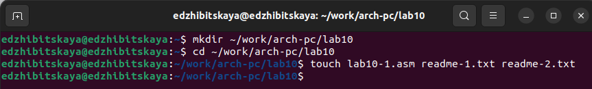
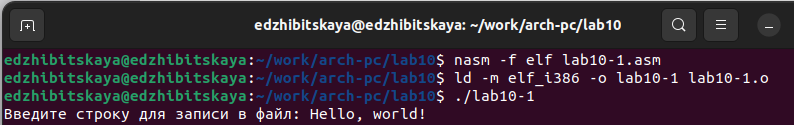
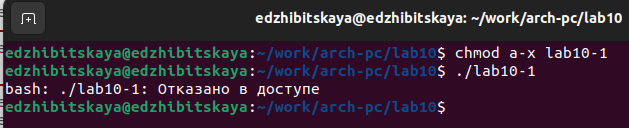
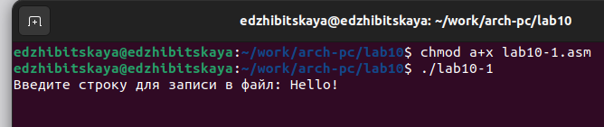
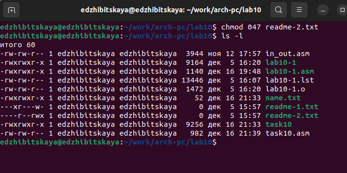
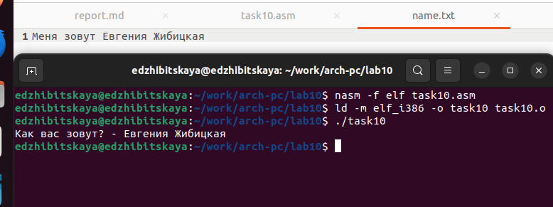

---
## Front matter
title: "Лабортарная работа №10"
subtitle: "Дисциплина: Архитектура компьютера"
author: "Жибицкая Евгения Дмитриевна"

## Generic otions
lang: ru-RU
toc-title: "Содержание"

## Bibliography
bibliography: bib/cite.bib
csl: pandoc/csl/gost-r-7-0-5-2008-numeric.csl

## Pdf output format
toc: true # Table of contents
toc-depth: 2
lof: true # List of figures
lot: true # List of tables
fontsize: 12pt
linestretch: 1.5
papersize: a4
documentclass: scrreprt
## I18n polyglossia
polyglossia-lang:
  name: russian
  options:
	- spelling=modern
	- babelshorthands=true
polyglossia-otherlangs:
  name: english
## I18n babel
babel-lang: russian
babel-otherlangs: english
## Fonts
mainfont: PT Serif
romanfont: PT Serif
sansfont: PT Sans
monofont: PT Mono
mainfontoptions: Ligatures=TeX
romanfontoptions: Ligatures=TeX
sansfontoptions: Ligatures=TeX,Scale=MatchLowercase
monofontoptions: Scale=MatchLowercase,Scale=0.9
## Biblatex
biblatex: true
biblio-style: "gost-numeric"
biblatexoptions:
  - parentracker=true
  - backend=biber
  - hyperref=auto
  - language=auto
  - autolang=other*
  - citestyle=gost-numeric
## Pandoc-crossref LaTeX customization
figureTitle: "Рис."
tableTitle: "Таблица"
listingTitle: "Листинг"
lofTitle: "Список иллюстраций"
lotTitle: "Список таблиц"
lolTitle: "Листинги"
## Misc options
indent: true
header-includes:
  - \usepackage{indentfirst}
  - \usepackage{float} # keep figures where there are in the text
  - \floatplacement{figure}{H} # keep figures where there are in the text
---

# Цель работы

Продолжение освоения языка ассемблера, изучение и приобретение навыков по работе с файлами и правами доступа.

# Выполнение лабораторной работы

Для начала создадим новый каталог, несколько файлов и скопируем файлin_out.asm(рис. @fig:001).

{#fig:001 width=70%}

 Затем введет текст Листинга 10-1 в файл, создадим исполняемый файл и запустим его.(рис. @fig:002).

{#fig:002 width=70%}

 
 Командой chmod запретим выполнение исполняемого файла(рис. @fig:003).

{#fig:003 width=70%}

Далее добавим право на исполнение исходному файлу lab10-1.asm  (рис. @fig:004). - файл исполняется после компиляции исполняемого файла повторно

{#fig:004 width=70%}

Предоставим права доступа к файлам readme-1.txt и readme-2.txt в символьном и двочном видах соответственно(рис. @fig:005).

{#fig:005 width=70%}

# Задание для самостоятельной работы

Напишем код пргораммы работающий по следующему алгоритму:
• Вывод приглашения “Как Вас зовут?”
• ввести с клавиатуры свои фамилию и имя
• создать файл с именем name.txt
• записать в файл сообщение “Меня зовут”
• дописать в файл строку введенную с клавиатуры
• закрыть файл

Создадим исполняемый файл, запустим и проверим корректность работы(рис. @fig:006).

{#fig:00 width=70%}

# Выводы

В ходе работы было поизведено знакомство с программами по работе с файлами, проведена работа с правами доступа.

